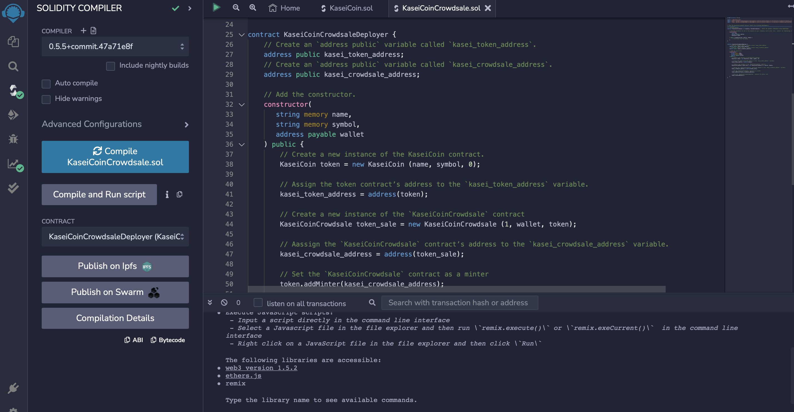

# Kasei Coin Crowdsale Application

## Challenge: Martian Token Crowdsale

You will create a fungible token that is ERC-20 compliant and that will be minted by using a `Crowdsale` contract from the OpenZeppelin Solidity library.

The crowdsale contract that you create will manage the entire crowdsale process, allowing users to send ether to the contract and in return receive KAI, or KaseiCoin tokens. Your contract will mint the tokens automatically and distribute them to buyers in one transaction.

### Steps

1. Create the KaseiCoin Token Contract

2. Create the KaseiCoin Crowdsale Contract

3. Create the KaseiCoin Deployer Contract

4. Deploy the Crowdsale to a Local Blockchain

5. Optional: Extend the Crowdsale Contract by Using OpenZeppelin

#### Create the KaseiCoin Token Contract

1. Import the provided `KaseiCoin.sol` starter file into the Remix IDE.

2. Import the following contracts from the OpenZeppelin library:

    * `ERC20`

    * `ERC20Detailed`

    * `ERC20Mintable`

3. Define a contract for the KaseiCoin token called `KaseiCoin`, and have the contract inherit the three contracts that you just imported from OpenZeppelin.

4. Inside of your `KaseiCoin` contract, add a constructor with the following parameters: `name`, `symbol`, and `initial_supply`.

5. Then, as part of your constructor definition, add a call to the `ERC20Detailed` contract’s constructor, passing the parameters `name`, `symbol`, and `18`. Recall that 18 is the value for the `decimal` parameter.

6. Compile the contract using compiler version 0.5.5.

7. Check for any errors and debug as needed.

8. KaseiCoin Token Contract Compilation

#### Create the KaseiCoin Crowdsale Contract

1. Import the provided `KaseiCoinCrowdsale.sol` starter code into the Remix IDE.

2. Have this contract inherit the following OpenZeppelin contracts:

* `Crowdsale`

* `MintedCrowdsale`

3. Within the `KaisenCoinCrowdsale` constructor, provide parameters for all of the features of your crowdsale, such as `rate`, `wallet` (where the funds that the token raises should be deposited), and `token`. Configure these parameters as you see fit for your KaseiCoin token.

4. Compile the contract using compiler version 0.5.5.

5. Check for any errors and debug as needed.

6. KaseiCoin Crowdsale Contract Compilation

#### Create the KaseiCoin Deployer Contract

1. Create an `address public` variable called `kasei_token_address`, which will store `KaseiCoin`’s address once that contract has been deployed.

2. Create an `address public` variable called `kasei_crowdsale_address`, which will store `KaseiCoinCrowdsale`'s address once that contract has been deployed.

3. Add the following parameters to the constructor for the `KaseiCoinCrowdsaleDeployer` contract: `name`, `symbol`, and `wallet`.

4. Inside of the constructor body (between the curly braces), complete the following steps:

    * Create a new instance of the `KaseiCoinToken` contract.

    * Assign the KaseiCoin token contract’s address to the `kasei_token_address` variable. This will allow you to easily fetch the token's address later.

    * Create a new instance of the `KaseiCoinCrowdsale` contract using the following parameters:

       * `rate` (Set `rate` equal to 1 in order to maintain parity with ether.)

       * `wallet` (Pass `wallet` in from the main constructor. This is the wallet that will get paid all of the ether raised by the crowdsale contract.)

       * `token` (This should be the `token` variable where `KaseiCoin` is stored.)

    * Assign the KaseiCoin crowdsale contract’s address to the `kasei_crowdsale_address` variable. This will allow you to easily fetch the crowdsale’s address later.

    * Set the `KaseiCoinCrowdsale` contract as a minter.

    * Have the `KaseiCoinCrowdsaleDeployer` renounce its minter role.

5. Compile the contract using compiler version 0.5.5.

6. Check for any errors and debug as needed.

7. KaseiCoin Deployer Contract Compilation

#### Deploy the Crowdsale to a Local Blockchain

In this section, you will deploy the crowdsale to a local blockchain using Remix, MetaMask, and Ganache. To do so, complete the following steps. Record a short video or take screenshots that illustrate the three steps outlined below as evidence of your deployed crowdsale contract.

1. Deploy the crowdsale to a local blockchain with Remix, MetaMask, and Ganache.

2. Test the functionality of the crowdsale by using test accounts to buy new tokens and then checking the balances associated with those accounts.

3. After purchasing tokens with one or more test accounts, view the total supply of minted tokens and the amount of wei that has been raised in the crowdsale contract.
